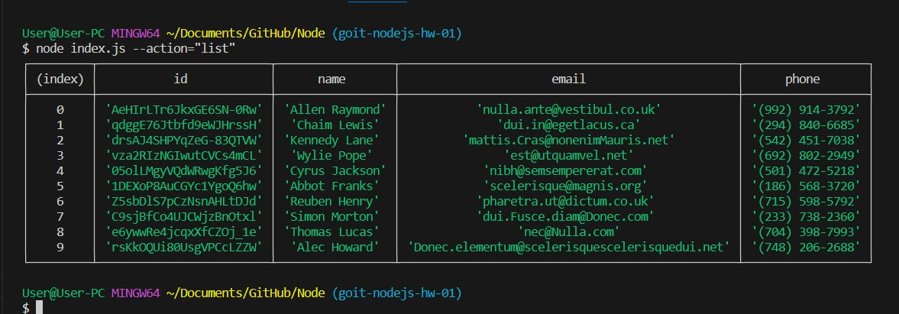
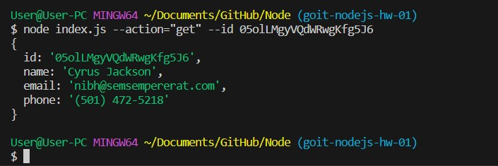
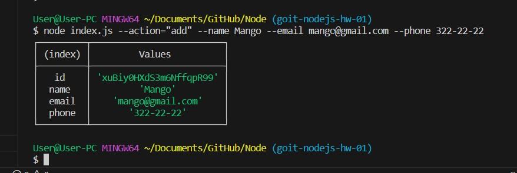
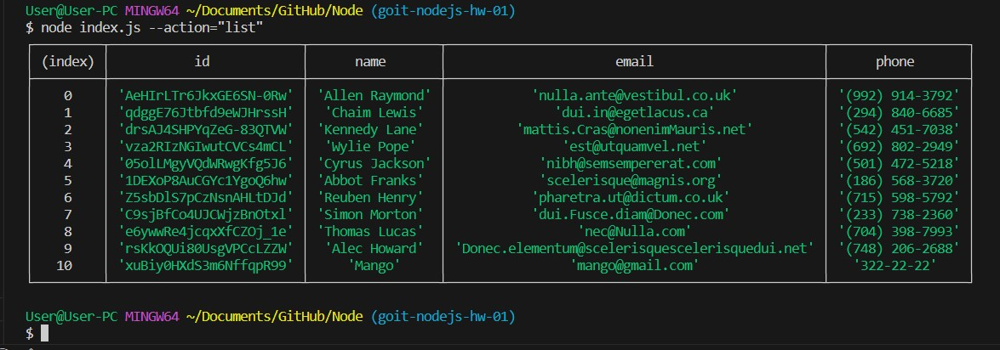
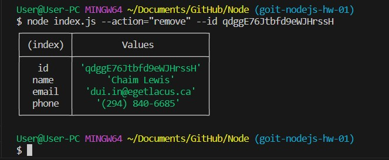
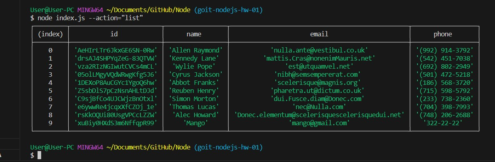

# Node
<h2>goit-nodejs-hw-01</h2>

# Отримуємо і виводимо весь список контактів у вигляді таблиці 

node index.js --action="list"

 
https://ibb.co/74Cb6Zq

# Отримуємо контакт по id

node index.js --action="get" --id 05olLMgyVQdWRwgKfg5J6

 
https://ibb.co/0p7CSZS

# Додаємо контакт

node index.js --action="add" --name Mango --email mango@gmail.com --phone 322-22-22

 
https://ibb.co/mSZZhRv 

# Перевіряємо дію

node index.js --action="list"

 
https://ibb.co/c2F4mPY

# Видаляємо контакт

node index.js --action="remove" --id qdggE76Jtbfd9eWJHrssH

 
https://ibb.co/R9jMf62

# Перевіряємо дію

node index.js --action="list"

 
https://ibb.co/wr6GKBs